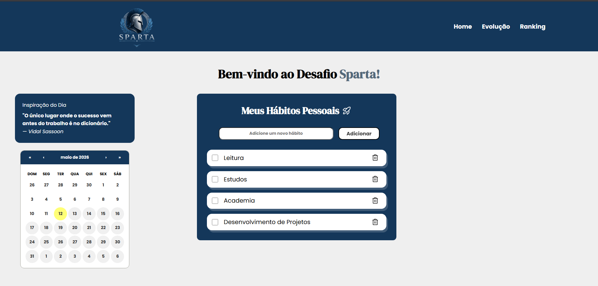

# 🏛️ Sparta — Habit Tracker

> Turn your habits into daily achievements with the Sparta Challenge.



## 📌 About the Project

**Sparta** is a habit tracking web application inspired by Spartan discipline, focused on consistency, personal growth, and daily execution.

### Features

- ✅ Create and manage personalized habits  
- 📅 Track your consistency with an interactive calendar  
- 💬 Receive daily motivational quotes

## 🚀 Technologies

- **React.js** — component-based UI development  
- **JavaScript (ES6+)** — application logic and state management  
- **CSS Modules** — custom styling with a unique visual identity  

## 🔜 In Development

- [ ] User ranking system  
- [ ] Progress and analytics section  
- [ ] Back-end  
- [ ] Database  
- [ ] User authentication  
- [ ] Cloud deployment  

## 💻 Running Locally

```bash
# Clone the repository
git clone https://github.com/guiborgesw/Sparta.git

# Navigate to the project folder
cd Sparta

# Install dependencies
yarn install

# Start the development server
yarn start
```

Access at: `http://localhost:3000`

## 👨‍💻 Author **Guilherme Borges**
- LinkedIn: [linkedin.com/in/guiborgesw](https://www.linkedin.com/in/guiborgesw)